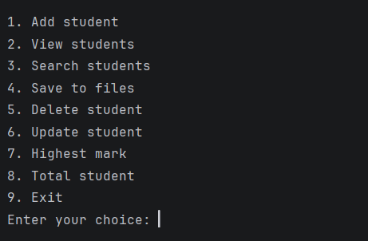
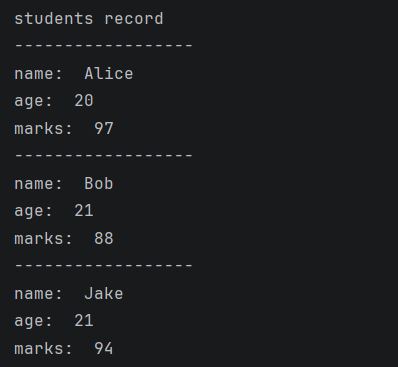
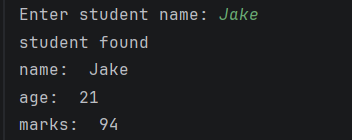
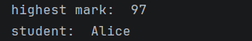

# Student Management System

## Description

A menu-driven Student Management System developed using Python. The application allows users to manage student records efficiently by adding, viewing, searching, updating, and deleting student information. It also provides features for saving records to files, analyzing student performance, finding the highest mark, and displaying the total number of students.

## Features

* Add new student records
* View all students
* Search for a student by name
* Update student details
* Delete student records
* Save student data to a file
* Find the student with the highest mark
* Display total number of students
* Menu-driven user interface

## Technologies Used

* Python
* Lists
* Dictionaries
* Functions
* File Handling

## Screenshots

### Main Menu



### View Students



### Search Student



### Highest Mark



## How to Run

1. Install Python
2. Download the project files
3. Run the program

```bash
python student_management_system.py
```

## Project Structure

```text
student-management-system
│
├── student_management_system.py
├── main_menu.png
├── view_students.png
├── highest_mark.png
├── search_student.png
└── README.md
```

## Author

Fasna Shabeer
